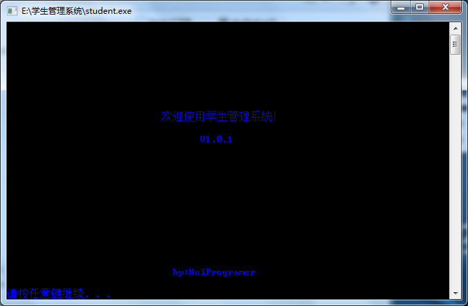
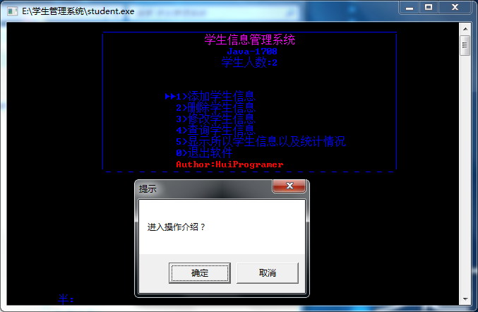
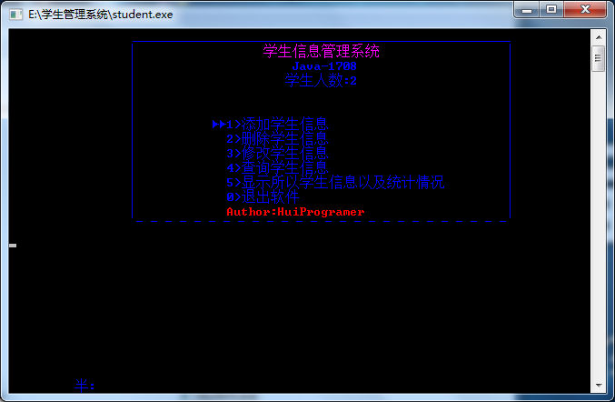
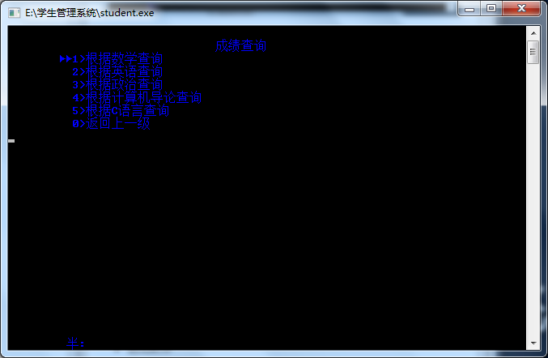
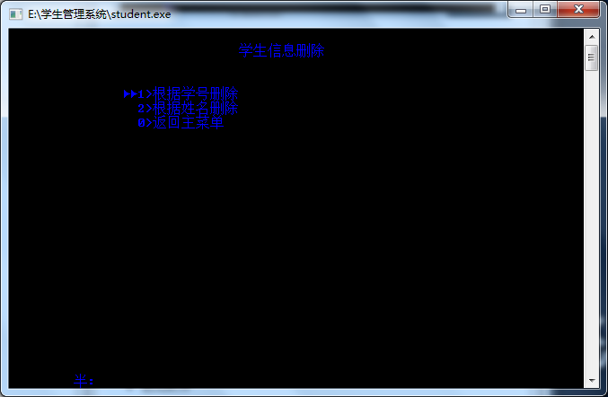

学生管理系统
============

<h4 style = "color:green">通过单链表存储数据<h4>
<h4 style = "color:green">通过文件保存数据<h4>

<h4>操作介绍：</h4>
通过上下键选择 
Enter键确定进入 
<h3>初始化界面</h3>

<h3>操作介绍页面</h3>

<h3>用户界面</h3>

<h3>查询成绩</h3>

<h3 style = "color:red">删除学生信息</h3>

<h5>目前拥有功能：</h5>

* 添加学生信息

* 删除学生信息
   1. 根据学号删除
   2. 根据姓名删除

* 修改学生信息
   1. 根据学号修改
   2. 根据姓名修改

* 查询学生信息
   1. 根据学号查询
   2. 根据姓名查询
   3. 根据成绩查询

* 显示所有学生信息以及统计情况

* 退出软件